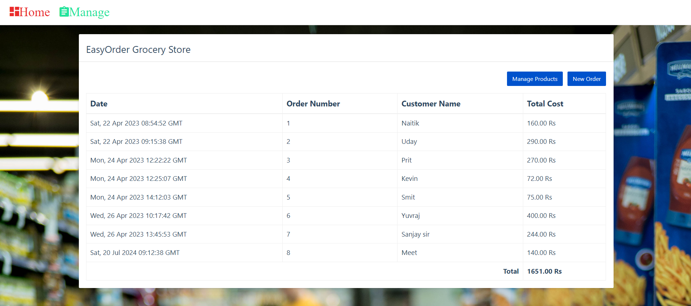
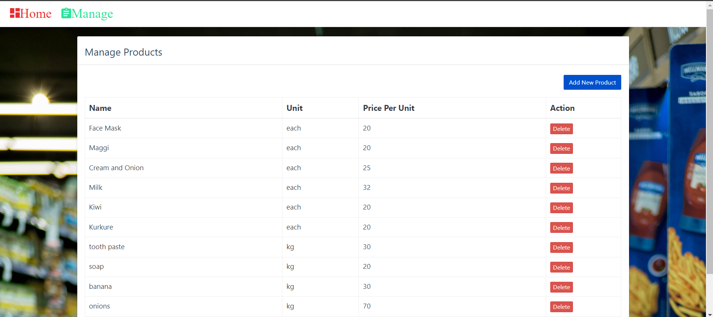
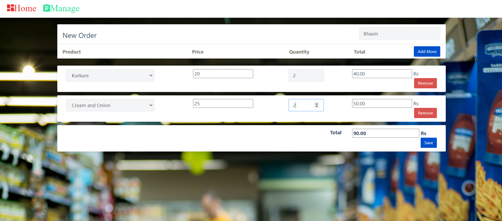

# EasyOrder Grocery Store Management System

EasyOrder Grocery Store Management System is a comprehensive solution designed to streamline the operations of grocery stores. This project integrates modern web development technologies to create a user-friendly interface for managing inventory, processing orders, and handling customer interactions efficiently.

## Table of Contents

- [Features](#features)
- [Technologies](#technologies)
- [Installation](#installation)
- [Usage](#usage)
- [Screenshots](#screenshots)
- [Contributing](#contributing)
- [License](#license)
- [Contact](#contact)

## Features

- **Inventory Management**: Add, edit, and manage grocery items in the store's inventory.
- **Order Processing**: Handle customer orders and track order history.
- **Responsive Design**: Optimized for both desktop and mobile devices.

## Technologies

- **Frontend**: HTML, CSS, JavaScript
- **Backend**: Python (Flask)
- **Database**: MySQL

## Installation

1. **Clone the repository**:
    ```sh
    git clone https://github.com/Naitik-554/EasyOrder-Grocery-Store.git
    cd EasyOrder-Grocery-Store
    ```

2. **Set up a virtual environment** (optional but recommended):
    ```sh
    python -m venv venv
    source venv/bin/activate  # On Windows, use `venv\Scripts\activate`
    ```

3. **Install backend dependencies**:
    ```sh
    pip install -r requirements.txt
    ```

4. **Set up MySQL database**:
    - Create a new database in MySQL.
    - Update the database configuration in `config.py` (or equivalent configuration file) with your MySQL credentials.

5. **Run database migrations**:
    ```sh
    flask db upgrade  # For Flask-Migrate if using Flask
    ```

6. **Run the backend server**:
    ```sh
    flask run  # If using Flask
    ```

## Usage

- **Inventory Management**:
  - Add new products to the inventory.
  - Update existing product details.
  - Remove products from the inventory.

- **Order Processing**:
  - Track and manage order history.

## Screenshots

### Dashboard


### Inventory Management


### Order Processing


## Contributing

There are a lot of new updates which can be brought in this website.
Contributions are welcome! Please fork this repository and submit pull requests with the following:
- A clear description of the changes.
- Screenshots or demos of new features.
- Relevant documentation updates.

## License

This project is licensed under the MIT License. See the [LICENSE](LICENSE) file for more details.

